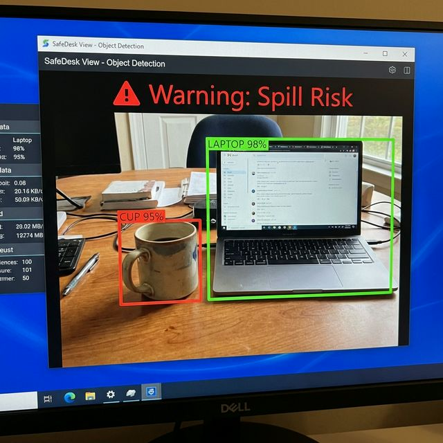

# ESUA: Environment Spatial Understanding Assistant

## Overview
**ESUA** (Environment Spatial Understanding Assistant) is an intelligent, real-time computer vision system that proactively analyzes spatial relationships between objects to identify and warn users of potential hazards. By moving beyond simple object detection, ESUA understands *context* — such as the dangerous proximity of liquids to electronics or flammable materials — and provides actionable safety alerts before accidents occur.

## Tech Stack
| Component | Technology | Description |
|-----------|------------|-------------|
| **Language** | Python 3.x | Core application logic |
| **Computer Vision** | OpenCV | Image processing, camera feed, and bounding box rendering |
| **Object Detection** | YOLOv8 (Ultralytics) | Lightweight, real-time object classification and localization |
| **Hardware Target** | CPU/Webcam | Optimized for edge execution without requiring a dedicated GPU |

## High-Level Architecture
ESUA operates a highly optimized pipeline to deliver real-time insights:
1. **Video Ingestion:** Captures frames from a local webcam into a multi-frame buffer.
2. **Object Detection:** Identifies elements in the frame (e.g., cups, laptops, people) using YOLOv8.
3. **Temporal Aggregation:** Filters out transient noise and ghost detections by confirming object stability across multiple consecutive frames.
4. **Spatial Reasoning:** Calculates bounding box centers and computes distances to determine proximity (near vs. far) and overlap states.
5. **Risk Analysis:** Matches spatial relationships against predefined safety heuristics (e.g., "liquid + electronics = spill risk").
6. **Explanation Generation:** Generates human-readable warnings and visually highlights the involved objects on the live camera feed.

## Example: Input → Output

**Input:** A user sets a full coffee mug dangerously close to their open laptop while working.


**Output:** ESUA instantly detects the proximity, flags the interaction based on semantic categories (liquid container near electronics), and updates the video feed with a warning.


## Quick Start
```bash
# Clone the repository
git clone https://github.com/yourusername/ESUA.git
cd ESUA

# Install dependencies
pip install -r requirements.txt

# Run the live camera assistant
python ESUA/phase6_camera_integration/snapshot_analyzer.py
```

## Documentation Reference
Explore the full documentation in the `docs/` directory:
- [System Architecture](docs/architecture.md)
- [Installation & Setup](docs/setup.md)
- [How to Run](docs/how_to_run.md)
- [Feature Details](docs/features.md)
- [Data Flow](docs/data_flow.md)
- [Use Cases](docs/use_cases.md)
- [Deployment Guide](docs/deployment.md)

## Future Roadmap & Improvements
- **3D Depth Estimation:** Incorporating depth cameras (e.g., Intel RealSense) to calculate true 3D spatial distances rather than 2D pixel approximations.
- **Dynamic Risk Rules:** Allowing users to define custom safety heuristics via a configuration file.
- **Audio Alerts:** Integrating text-to-speech (TTS) to physically warn users when they are not looking at the screen.
- **Edge Device Optimization:** Porting the models to run natively on edge TPUs, Raspberry Pi, or Jetson Nano.

## Contact
**Author:** [Your Name / Engineering Team]  
**LinkedIn:** [Your LinkedIn Profile]  
**Portfolio:** [Your Resume/Portfolio Link]  
