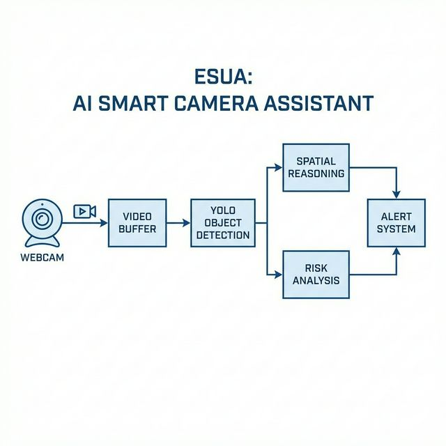

# ESUA System Architecture

This document describes the high-level architecture of the **Environment Spatial Understanding Assistant (ESUA)** pipeline.

## System Overview

ESUA is designed to run locally, interpreting a video stream through a series of specialized modules. The system architecture avoids monolithic design by separating object detection from spatial cognition and risk evaluation. 

## Core Components

The pipeline processes data stage-by-stage:

### 1. The Video Ingestion Ring Buffer
- **Source:** Local hardware (e.g., standard webcams via OpenCV `cv2.VideoCapture`).
- **Mechanism:** Implements a rolling buffer (`collections.deque(maxlen=BUFFER_SIZE)`) to keep the latest $N$ frames in memory.
- **Purpose:** Prevents ghost detections and transient noise by aggregating object temporal instances before they are formally submitted for spatial processing.

### 2. Object Detection Module
- **Engine:** Ultralytics YOLOv8 Nano (`yolov8n.pt`).
- **Role:** Extracts unrefined spatial coordinates (bounding boxes `[x1, y1, x2, y2]`) and classification labels for all recognized entities in the frame.
- **Handling:** Confidence thresholds are dynamically allocated per object class (e.g., lower threshold for a `cup` to maximize recall, strictly higher threshold for a `person` to avoid false positives).

### 3. Temporal Stability Aggregation
- **Mechanism:** ESUA groups detections that are both spatially contiguous (using `GROUPING_DISTANCE_THRESHOLD`) and matching in class across the $N$-frame ring buffer.
- **Condition:** An object is only verified and forwarded to subsequent logic if it is present in at least `CONFIRMATION_THRESHOLD_FRAMES` frames within the buffer slice.

### 4. Spatial Reasoning Engine
- **Role:** Translates raw bounding box coordinates into semantic geometric relationships.
- **Techniques:**
  - **Centroid Calculation:** Simplifies complex geometries into center points (`(x1+x2)//2`, `(y1+y2)//2`).
  - **Euclidean Proximity:** Measures Cartesian pixel distance between the centroids of two distinct objects.
  - **Overlap Detection:** Uses coordinate bounding logic to ascertain whether physical occlusion or intersection is actively occurring.
  - **Relative Positioning:** Sorts objects geometrically into descriptive categories (e.g., *left of*, *near*, *far from*).

### 5. Risk Heuristics Evaluation & Explanation Generation
- **Categorization Dictionary:** Objects evaluated by the temporal aggregation layer are expanded via `object_categories` (such that a `bottle` is identified logically as a `liquid container`).
- **Rule Matching:** The system evaluates pairs of proximal objects against `risk_rules.py` (e.g., logic verifying whether a `liquid` object is `<400px` from an `electronic` object).
- **Template Generation:** Utilizes pre-formatted linguistic mappings in `explanation_templates.py` to create dynamic natural language warnings describing the specific context of the threat.

## Deployment Target Logic
Because the YOLOv8 Nano model weights are baked into the `d:\ESUA` root path, predictions default to the CPU but are optimized for low-latency feedback. Rendering latency is artificially mitigated by skipping inference on intermittent frames while maintaining bounding box interpolation over the continuous video feed display.
