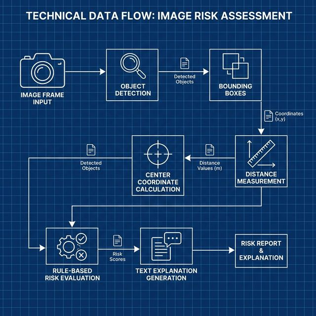

# Real-Time Data Flow

Understanding the path data takes through ESUA helps conceptualize how pixel arrays become actionable safety warnings.

## Step-by-Step Flow

### 1. Environmental Input 
Data enters the system exclusively as 2D pixel arrays representing RGB color spaces captured locally via standard OpenCV logic. 

**Transformation:**  
Raw frames are explicitly resized internally (`640x480`) to guarantee execution consistency and stabilize FPS performance against YOLO processing caps.

### 2. Detection & Instantiation
The array is fed into the Neural Network model (`yolov8n.pt`). Instead of processing every frame sequentially from a cold start, data is buffered temporally. 

**Transformation:**  
The model spits out a proprietary results object mapping classes to `[x1, y1, x2, y2, confidence_score]`. This data is extracted and mapped into a structured Python dictionary representation (`{name, box, center, conf}`).

### 3. Spatial Processing
ESUA iterates over the instantiated dictionary structure, matching every confirmed object against every other object contextually $O(N^2)$ to evaluate relationships.

**Transformation:**  
Points `center_a` and `center_b` are converted into an absolute integer defining Euclidean length. If the distance evaluates below `NEAR_THRESHOLD` ($400px$), the relationship state transitions to `near`.

### 4. Categorical Evaluation
Objects previously identified as plain nouns (e.g. `bottle`) are passed through the categorical mapper.

**Transformation:**  
`bottle` $\to$ `['liquid container', 'beverage']`.

### 5. Threat Flagging & Output Generation
If two categorically opposing items (`liquid container` + `electronic system`) share a `near` status tag, risk rules evaluate to `True`.

**Output:**  
A final string is fetched from `explanation_templates.py`, stitched together dynamically using variable injection (`{obj_a} is placed near {obj_b}...`), and subsequently overlayed via `cv2.putText()` directly onto the final output frame alongside bounded boxes.
